<div align="center">

#  Airbnb Clone

### A full-stack, feature-complete Airbnb marketplace — built from scratch with Next.js and FastAPI

Browse listings on an interactive map, book real date ranges with live price breakdowns, leave reviews after a stay, and manage your own listings as a host — all backed by a real database, real authentication, and a real booking engine (no Lorem Ipsum, no fake buttons).

<br/>


<br/>


<br/>

**[🔗 Live Demo](https://frontend-neon-three-34.vercel.app) &nbsp;·&nbsp; [⚙️ Backend API](https://airbnb-clone-8gur.onrender.com/docs) &nbsp;·&nbsp; [📦 GitHub Repo](https://github.com/dhanubansal777/Scaler-Airbnb) &nbsp;·&nbsp; [📖 Jump to Setup](#-getting-started)**

<sub>Frontend on Vercel, backend on Render (free tier — the API may take ~50s to wake up on first request after a period of inactivity). Backend API link above opens the interactive Swagger docs.</sub>

> **👉 Please use these seeded demo accounts to try the live demo** — all seeded accounts share the password **`password123`**. The backend runs on a free tier with an ephemeral disk, so accounts created via **Sign up** on the live demo won't survive a cold restart; the accounts below are re-seeded on every boot and always work.
>
> | Role | Email |
> |---|---|
> | Host | `host1@example.com` |
> | Guest | `guest1@example.com` |

</div>

<br/>

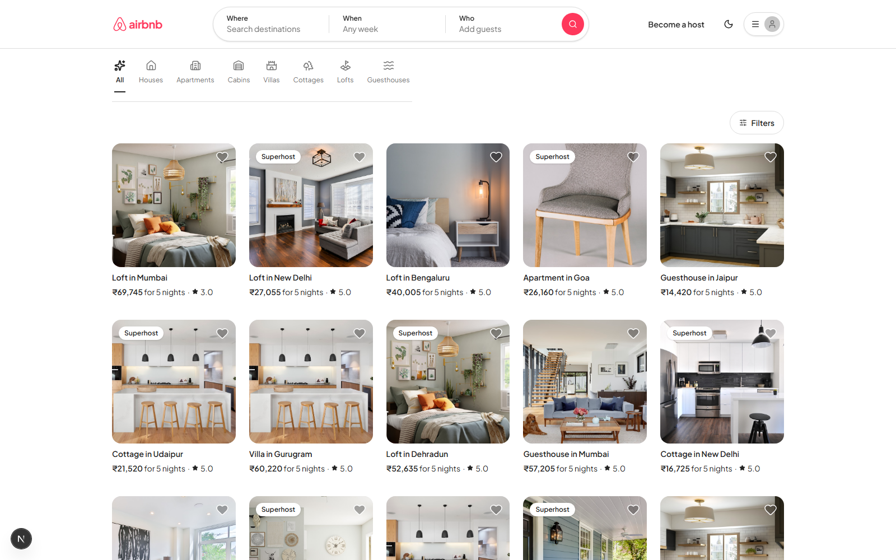

<br/>

## 📚 Table of Contents

- [What is this?](#-what-is-this)
- [Feature Tour](#-feature-tour-with-screenshots)
- [Tech Stack](#-tech-stack)
- [Architecture](#-architecture)
- [Database Schema](#-database-schema)
- [How Booking Works](#-how-a-booking-actually-works)
- [User Journey](#-user-journey)
- [Project Structure](#-project-structure)
- [Getting Started](#-getting-started)
- [Demo Accounts](#-demo-accounts)
- [API Reference](#-api-reference)
- [Deployment](#-deployment)
- [Bonus Features Checklist](#-bonus-features-checklist)
- [Assumptions / Mocked Data / Notes](#-assumptions--mocked-data--notes)

<br/>

## 🎯 What is this?

This is a from-scratch clone of Airbnb's core product, built as a full-stack engineering assignment. The goal wasn't to make something that *looks* like Airbnb in a screenshot — it's to make something that *behaves* like Airbnb: real search and filtering, a real date-range booking engine that actually blocks double-bookings, a real host dashboard with full CRUD, and a real review system gated on actually having stayed somewhere.

Everything runs on two services you can start locally in under five minutes:

```
┌─────────────────────┐        REST + JWT        ┌──────────────────────┐
│   Next.js Frontend   │ ────────────────────────▶ │   FastAPI Backend    │
│   (localhost:3000)   │ ◀──────────────────────── │   (localhost:8000)   │
└─────────────────────┘                            └───────────┬──────────┘
                                                                 │
                                                          ┌──────▼──────┐
                                                          │   SQLite    │
                                                          │  (app.db)   │
                                                          └─────────────┘
```

<br/>

## ✨ Feature Tour (with screenshots)

### 🔍 Search, browse, and filter — with a real map

The home page is a full explore grid: photo-forward cards, category shortcuts (Houses / Apartments / Cabins / Villas / Cottages...), a price/amenity filter drawer, and pagination. Every card shows a real aggregate rating and a computed **Superhost** badge.

Search for a specific city and the layout automatically switches into a **split list + map view** — just like the real thing — with clickable price-pin markers positioned at each listing's real coordinates, and a dashed "neighborhood boundary" outline traced around the search area.

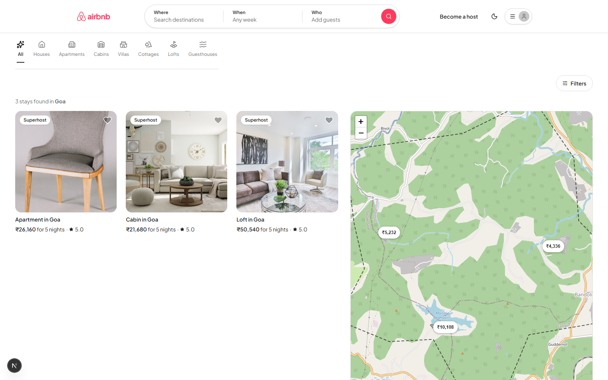

### 🏠 Listing detail — galleries, host profiles, live availability

Every listing page has a full photo gallery with lightbox, amenities grid, a "Meet your host" card with a computed Superhost badge and a mocked "Message host" action, an embedded map, and a sticky booking widget with a **live-updating price breakdown** as you pick dates.

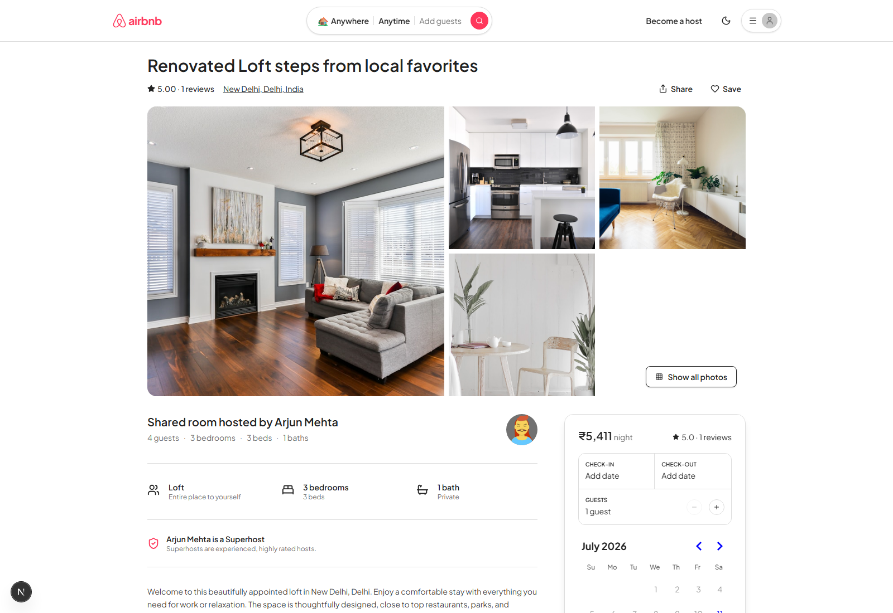

### 💳 A booking flow that's actually correct

Pick a date range → the calendar visually disables already-booked dates → "Reserve" opens a mocked checkout with the full price math (nightly rate × nights + cleaning fee + service fee) → "Confirm and pay" creates the booking. The backend **re-validates availability server-side** at the moment of booking, so it's not possible to double-book a listing even under concurrent requests — this isn't just a client-side date-picker restriction.

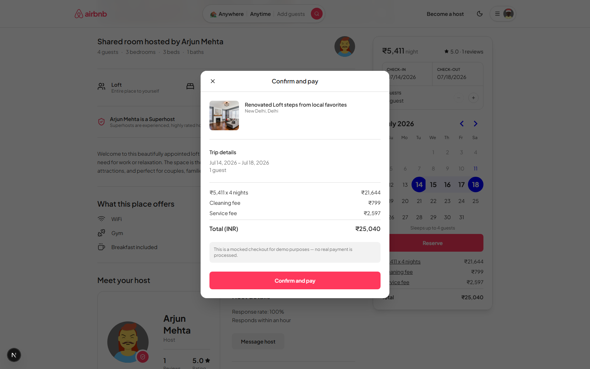

### 🧳 My Trips — and reviews that require proof of stay

Bookings are split into Upcoming / Past / Cancelled. Past stays get a **"Leave a review"** button — but only if you actually booked that listing and the stay has genuinely completed (`check_out` in the past). This is enforced on the backend, not just hidden in the UI, and the same review flow is also surfaced directly on the listing page itself when applicable.

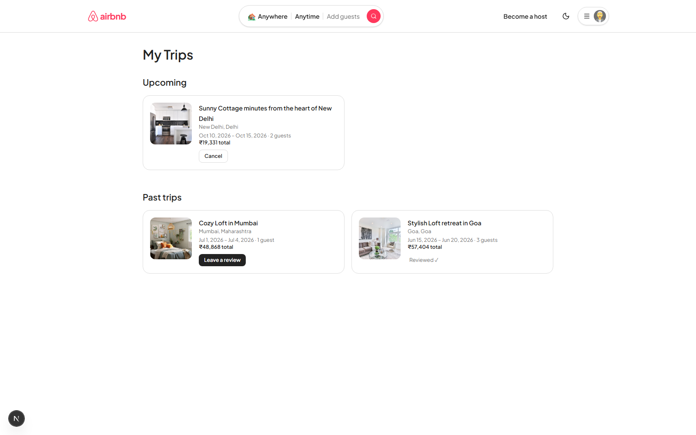

### 🏘️ Host dashboard — full CRUD, not a toy form

Switch into hosting from the navbar (no approval step, just like the assignment's "mocked" auth guidance), and get a dashboard of your own listings with booking counts and ratings, a reservations tab across every listing you own, and a full create/edit form — including click-to-drop-a-pin location picking and direct photo upload.

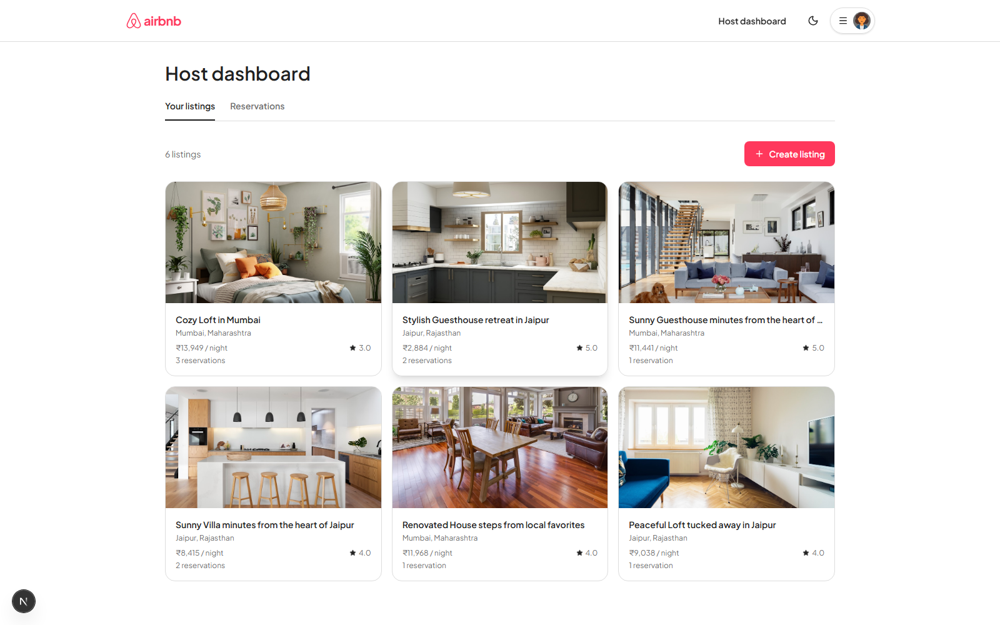

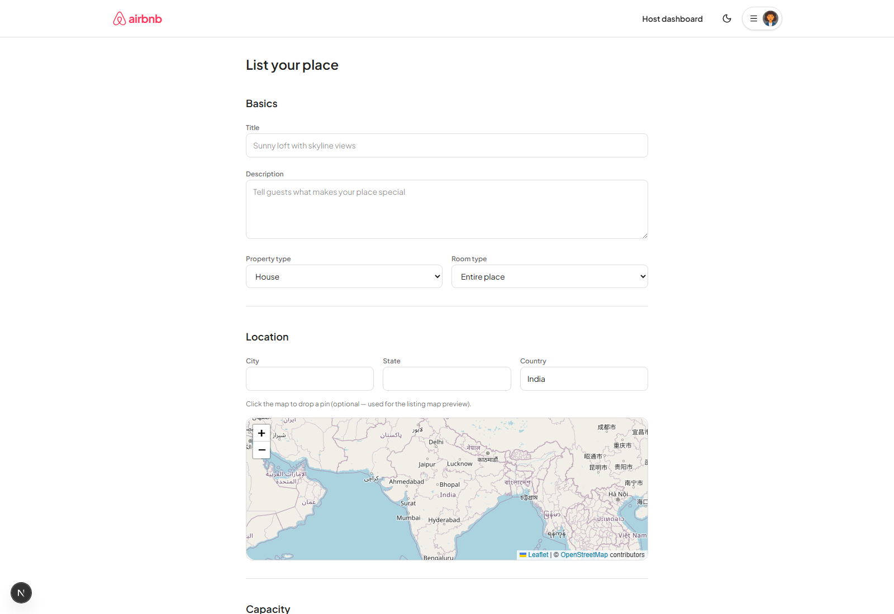

### 🌓 Dark mode & fully responsive

A real class-based dark mode toggle (not just OS-preference detection), and a layout that's been individually tested and fixed at 320px, 375px, 390px, 414px, 640px, 768px, 900px, 1024px, 1280px, and 1500px+ — including the trickier cases like the search-results map sidebar collapsing gracefully on tablet widths.

<p align="center">
  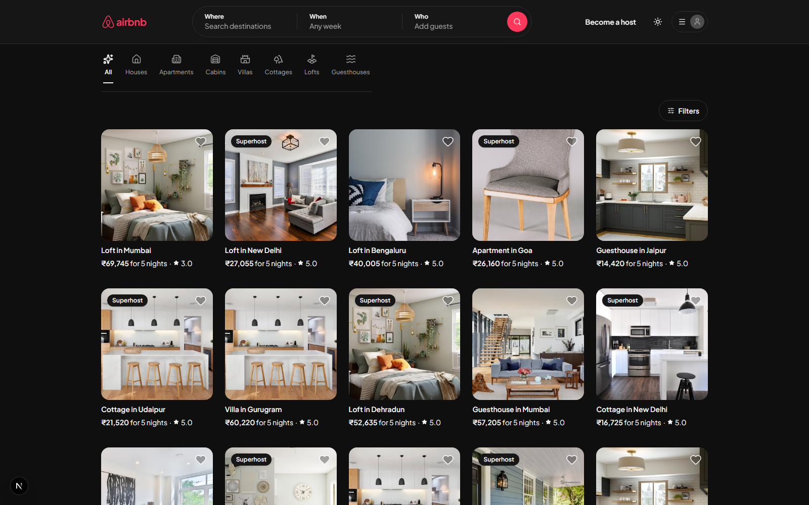
  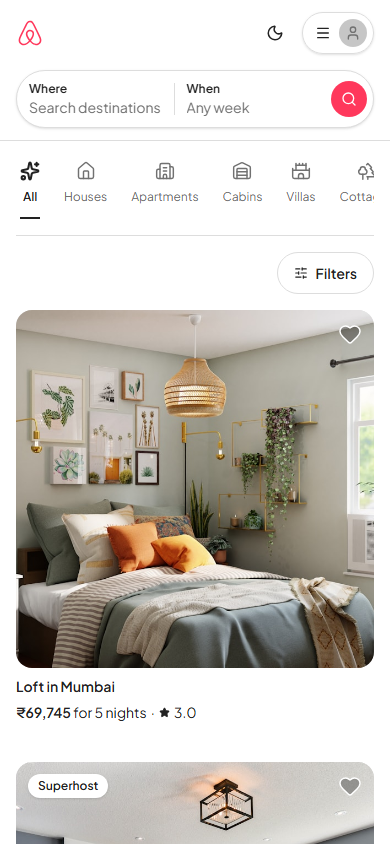
</p>

### 🦶 A footer that's actually useful

Destination shortcuts (functional — they filter real search results, not dead links), category tabs that swap the shown destinations, and a proper nav/legal/social bar — with placeholder pages for anything intentionally out of scope (Help Centre, Terms, etc.) instead of dead links.

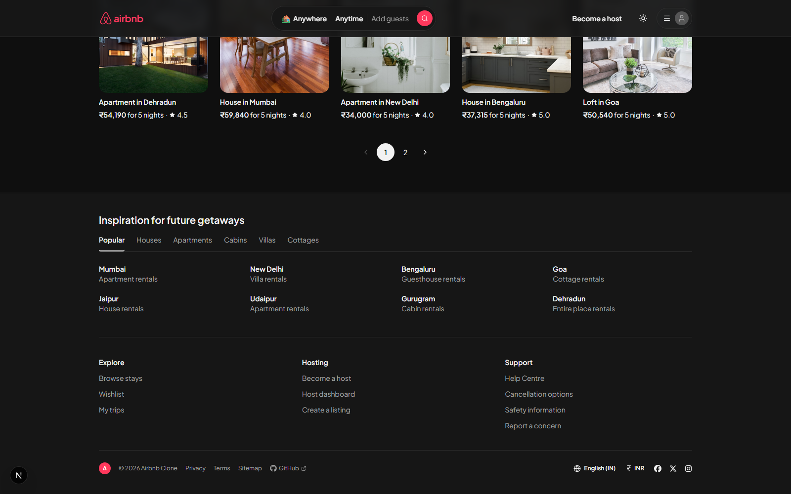

<br/>

## 🧱 Tech Stack

| Layer | Technology | Why |
|---|---|---|
| **Frontend framework** | Next.js 16 (App Router) + React 19 + TypeScript | Modern routing, server/client component split, strict typing end-to-end |
| **Styling** | Tailwind CSS v4 | Fast to iterate, theme-able via CSS variables for dark mode |
| **Maps** | react-leaflet + OpenStreetMap tiles | Real interactive maps with zero API keys / zero cost |
| **Date picking** | react-day-picker | Range selection with disabled/booked-date support |
| **Icons** | lucide-react + react-icons | Consistent icon system across the app |
| **Backend framework** | FastAPI (Python 3.12) | Async-ready, automatic OpenAPI docs, Pydantic validation |
| **ORM** | SQLAlchemy 2.0 | Typed models, clean relationship mapping |
| **Database** | SQLite | Zero-config, file-based — swappable to Postgres via one env var |
| **Auth** | JWT (python-jose) + bcrypt password hashing | Stateless auth, no session storage needed |
| **Validation** | Pydantic v2 | Request/response schemas shared as the single source of truth |

<br/>

## 🏗️ Architecture

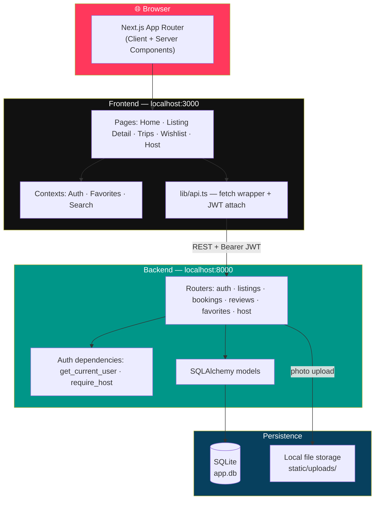

**Why this shape?** The frontend never talks to the database directly — every read and write goes through FastAPI, which is the single place that enforces business rules (ownership checks, booking-overlap validation, review eligibility). That means the rules can't be bypassed by calling the API directly instead of clicking through the UI — the same guarantees apply either way.

<br/>

## 🗄️ Database Schema

Seven tables, all properly normalized — no JSON blobs standing in for relational data.

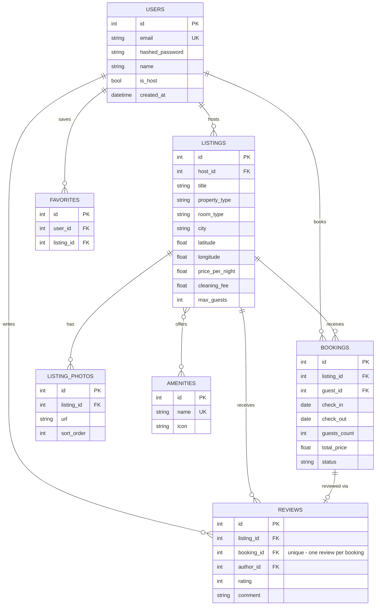

**A few deliberate design choices:**
- `bookings.total_price` and its fee components are **snapshotted** at booking time — if a host later changes their nightly rate, past bookings still show what the guest actually paid.
- `reviews.booking_id` is **unique**, so the database itself (not just application logic) prevents leaving two reviews for the same stay.
- `favorites` has a unique constraint on `(user_id, listing_id)` — no duplicate wishlist entries possible.
- `Superhost` status is **computed on read**, not stored — it's derived from a host's aggregate rating across all their listings (≥4.8 average, ≥3 reviews), so it's always accurate and never goes stale.

<br/>

## 🔁 How a Booking Actually Works

This is the part that separates a "looks like Airbnb" project from one that actually works like it — overlapping bookings are rejected **server-side**, not just prevented by graying out dates in the calendar.

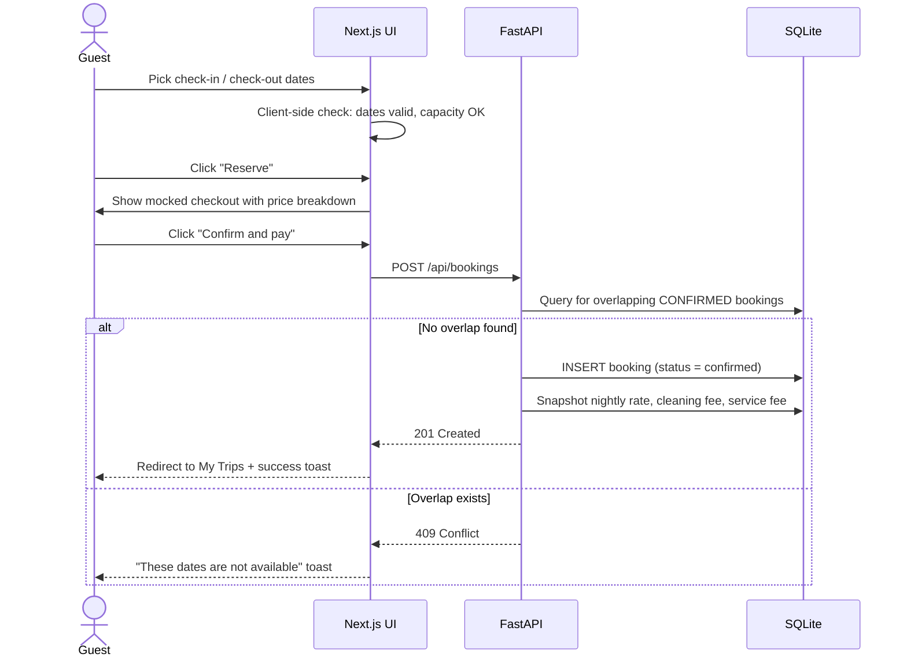

<br/>

## 🧭 User Journey

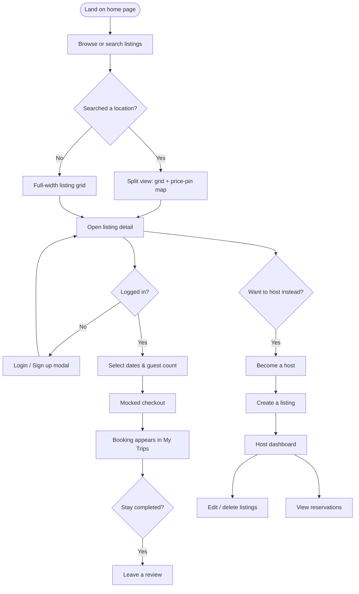

<br/>

## 📁 Project Structure

```
Airbnb/
├── backend/                          FastAPI application
│   ├── app/
│   │   ├── main.py                   App entrypoint · CORS · static mount · router registration
│   │   ├── config.py                 Environment-driven settings (pydantic-settings)
│   │   ├── database.py               SQLAlchemy engine/session
│   │   ├── models.py                 ORM models — see schema above
│   │   ├── schemas.py                Pydantic request/response models
│   │   ├── auth.py                   Password hashing + JWT encode/decode
│   │   ├── deps.py                   FastAPI dependencies (current user, optional user, require host)
│   │   ├── utils.py                  Rating aggregation, price breakdown, Superhost calculation
│   │   ├── seed.py                   Idempotent seed script — demo hosts/guests/listings/bookings/reviews
│   │   └── routers/                  auth · listings · bookings · reviews · favorites · host · amenities
│   ├── static/uploads/                Uploaded listing photos
│   ├── requirements.txt
│   └── render.yaml                    Render deployment config
│
├── frontend/                         Next.js application (App Router)
│   ├── app/                          Routes: / · /listings/[id] · /trips · /wishlist · /host · /coming-soon
│   ├── components/
│   │   ├── navbar/                   Navbar, SearchBar (expanded + compact), AuthModal
│   │   ├── listing/                  Card, Gallery, Map, PriceMap, BookingWidget, HostSection, Reviews
│   │   ├── host/                     ListingForm, LocationPicker, host dashboard tabs
│   │   ├── home/                     HomeClient, Footer
│   │   └── ui/                       Modal, Pagination, FilterDrawer, CategoryFilterBar
│   └── lib/                          api.ts · auth-context · favorites-context · search-context · types.ts
│
├── docs/screenshots/                 Screenshots used in this README
└── README.md
```

<br/>

## 🚀 Getting Started

### Prerequisites
- Python 3.11+
- Node.js 20+

### 1. Backend

```bash
cd backend
python -m venv venv

# Windows
venv\Scripts\activate
# macOS / Linux
source venv/bin/activate

pip install -r requirements.txt
cp .env.example .env              # sensible defaults, no editing required for local dev

python -m app.seed                # seeds the DB with demo hosts, guests, listings, bookings, reviews
uvicorn app.main:app --reload --port 8000
```

The API is now live at `http://localhost:8000` — interactive Swagger docs at `http://localhost:8000/docs`.

> To reset all data: delete `backend/app.db` and re-run `python -m app.seed`.

### 2. Frontend

```bash
cd frontend
npm install
cp .env.local.example .env.local  # NEXT_PUBLIC_API_URL=http://localhost:8000
npm run dev
```

The app is now live at `http://localhost:3000`.

<br/>

## 🔑 Demo Accounts

All seeded accounts share the password **`password123`**.

| Role | Email | Notes |
|---|---|---|
| Host | `host1@example.com` → `host4@example.com` | Each owns several listings across Indian cities |
| Guest | `guest1@example.com`, `guest2@example.com` | `guest1` has a real unreviewed past stay pre-seeded, so the review flow has something to demonstrate immediately |

Any account can switch into hosting via **"Become a host"** in the navbar — there's no approval step, matching the assignment's guidance that auth can be simplified as long as a real guest/host distinction exists.

<br/>

## 📡 API Reference

<details>
<summary><strong>Click to expand the full endpoint table</strong> (or just visit <code>/docs</code> once the backend is running — it's always up to date)</summary>

<br/>

All endpoints are prefixed `/api`. `optional` auth means the endpoint works logged-out but personalizes the response (e.g. `is_favorited`) when a valid token is supplied.

| Method | Path | Auth | Description |
|---|---|---|---|
| POST | `/auth/signup` | – | Create account, returns JWT |
| POST | `/auth/login` | – | Returns JWT |
| GET | `/auth/me` | required | Current user |
| PATCH | `/auth/become-host` | required | Flip `is_host` to true |
| GET | `/amenities` | – | Fixed amenity list |
| GET | `/listings` | optional | Search / filter / paginate listings (location, dates, guests, price, property type, amenities) |
| GET | `/listings/{id}` | optional | Full listing detail — photos, amenities, host, rating, booked date ranges |
| POST | `/listings` | host | Create listing |
| PATCH | `/listings/{id}` | owner | Update listing |
| DELETE | `/listings/{id}` | owner | Delete listing |
| POST | `/listings/{id}/photos` | owner | Upload a photo file, returns its URL |
| POST | `/bookings` | required | Create booking (validates capacity + availability server-side) |
| GET | `/bookings/me` | required | Current user's bookings |
| DELETE | `/bookings/{id}` | owner | Cancel a booking |
| POST | `/listings/{id}/reviews` | required | Review a completed stay (must own a past, unreviewed, confirmed booking) |
| GET | `/listings/{id}/reviews` | – | List reviews for a listing |
| POST / DELETE | `/favorites/{listing_id}` | required | Toggle wishlist |
| GET | `/favorites/me` | required | Current user's wishlist |
| GET | `/host/listings` | host | Own listings + booking counts |
| GET | `/host/bookings` | host | Bookings across all owned listings |

</details>

<br/>

## ☁️ Deployment

The app is two independently deployable services.

**Backend → Render**
1. Push this repo to GitHub (already done if you're reading this on GitHub 👋).
2. On Render: **New → Web Service** → point at the `backend/` directory. Render will pick up `render.yaml` automatically (build: `pip install -r requirements.txt`, start: `uvicorn app.main:app --host 0.0.0.0 --port $PORT`). `backend/.python-version` pins the runtime to `3.12.10` — without it, Render can default to a Python version too new for `pydantic-core`'s prebuilt wheels and fail the build.
3. Set environment variables: `SECRET_KEY` (any random string), `CORS_ORIGINS` (your Vercel frontend URL, once you have it — comma-separate multiple origins).
4. **No manual seeding step needed.** `app/main.py` calls `run_seed()` on startup, which is idempotent (skips if the database already has users) — the demo data appears automatically on first boot. This also matters because Render's free tier has an ephemeral filesystem (SQLite resets on every redeploy/restart) and no Shell access, so a one-time manual seed wouldn't survive anyway. For a longer-lived deployment, swap in Postgres by changing `DATABASE_URL`, no code changes needed.

**Frontend → Vercel**
1. Import this repo on Vercel, set the root directory to `frontend/`.
2. Set environment variable `NEXT_PUBLIC_API_URL` to your Render backend URL.
3. Deploy, then add the resulting Vercel URL to the backend's `CORS_ORIGINS` env var on Render (this triggers a quick redeploy, no rebuild needed).

<br/>

## ✅ Bonus Features Checklist

| Feature | Status | Notes |
|---|:---:|---|
| Interactive map with listing pins | ✅ | Search results (price-pin map + boundary outline), listing detail (location map), host form (click-to-pin) |
| Leave a review after a completed stay | ✅ | Enforced server-side: must own a past, confirmed, unreviewed booking. Surfaced on both My Trips and the listing page |
| Superhost badges / ratings aggregation | ✅ | Computed live (≥4.8 avg rating, ≥3 reviews), shown on listing cards, listing detail, and the host section |
| Image upload to cloud storage | 🟡 | Real file upload works end-to-end, but saves to local disk rather than a cloud provider — see [Notes](#-assumptions--mocked-data--notes) |
| Dark mode | ✅ | Real class-based toggle (`next-themes`), persisted, independent of OS preference |
| Responsive design (mobile, tablet, desktop) | ✅ | Individually tested and fixed across breakpoints from 320px to 1500px+ |

<br/>

## 📝 Assumptions / Mocked Data / Notes

### Assumptions
- **Authentication** uses secure password hashing (bcrypt) with JWT-based sessions — a standard, production-grade pattern that cleanly demonstrates role-based access (guest vs. host) without unnecessary complexity like email verification or OAuth, which the assignment doesn't require. Any user can seamlessly switch into hosting via "Become a Host," reflecting Airbnb's real-world model where every user is both a potential guest and host.
- **SQLite** powers local development for zero-config setup. The app is fully database-agnostic through SQLAlchemy, so production deployments can point to Postgres via a single environment variable — no code or query changes required (the backend already ships the `psycopg2` driver for this).
- **Currency & locale**: the app is built around the Indian market — all seed data reflects real Indian cities (Mumbai, Delhi, Bengaluru, Goa, Jaipur, Udaipur, Gurugram, Dehradun), with pricing shown in ₹ (INR) using proper Indian numeric formatting.

### Mocked / Placeholder Data
- **Payments are simulated end-to-end** — "Confirm and Pay" runs the full booking flow (price breakdown, backend validation, persistence) without integrating a real payment gateway, exactly as scoped by the assignment.
- **Messaging and identity verification** are represented with a polished "Coming Soon" experience instead of dead buttons, keeping the UI complete while staying within the assignment's defined scope.
- **Map neighborhood boundaries** use a deterministic, organically-generated outline seeded from each search's listing cluster, giving a realistic visual without requiring a full GIS dataset.
- **Listing photos** are a hand-picked set of verified, high-quality interior/exterior images matched to each property type, giving the demo a polished, realistic feel out of the box. Hosts adding their own listings can use any image URL or a direct file upload.

### Notes
- **Photo uploads** run through a clean, pluggable storage layer — currently backed by local disk for simplicity, with the handler designed so a cloud provider (S3, Cloudinary) can be swapped in without any frontend changes.
- **Demo accounts** (`host1@example.com`, `guest1@example.com`, password `password123`) are automatically seeded on every deployment, so the live demo is always populated and ready to explore immediately.

<br/>

<div align="center">

Built as a full-stack engineering assignment. Every feature described above was actually clicked through and verified working, not just written and assumed.

</div>
